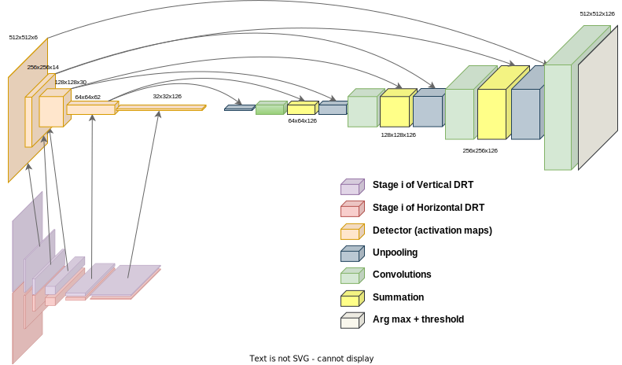
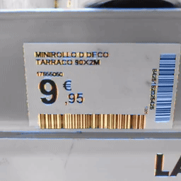

# An encoder-decoder architecture within a classical signal processing framework for real-time barcode segmentation. 

    

    

## Authors of the paper
 * Óscar Gómez-Cárdenes (University of La Laguna)
 * José Gil Marichal-Hernández (University of La Laguna)
 * Jung-Young Son (Konyang University)
 * Rafael Pérez Jiménez (IDeTIC, University of Las Palmas de Gran Canaria)
 * José Manuel Rodríguez-Ramos (Wooptix S.L., University of La Laguna)

## Citing this work 
If using this work, please cite us.

Gómez-Cárdenes, Ó.; Marichal-Hernández, J.G.; Son, J.-Y.; Pérez Jiménez, R.; Rodríguez-Ramos, J.M. An Encoder–Decoder Architecture within a Classical Signal-Processing Framework for Real-Time Barcode Segmentation. Sensors 2023, 23, 6109. https://doi.org/10.3390/s23136109

## Description
This code accompanies the paper "An encoder-decoder architecture within a classical signal processing framework for real-time barcode segmentation". 

Link to the paper: [https://www.mdpi.com/2371152](https://www.mdpi.com/2371152)

The four algorithms analyzed in this paper are provided in the code:

 * PDRT 2: Partial Discrete Radon Transform with `tile_size=2`.
 * PDRT 32: Partial Discrete Radon Transform with `tile_size=32`.
 * PS DRT: Partial Strided DRT based detector with `tile_size=32` and `stride=2`.
 * MDD DRT: Multiscale Domain Detector based on the DRT.

For each of these algorithms, two different implementations are provided, 

1. Python with Numba: used for prototyping and design (located  in `./python`)
2. Halide in C++: used for performance targeting different architectures (located in `./cpp`)

## Using the Python version
See [python/README.md](python/README.md)

## Using the C++/Halide version
See [cpp/README.md](cpp/README.md)

## License
See [license file](LICENSE)
